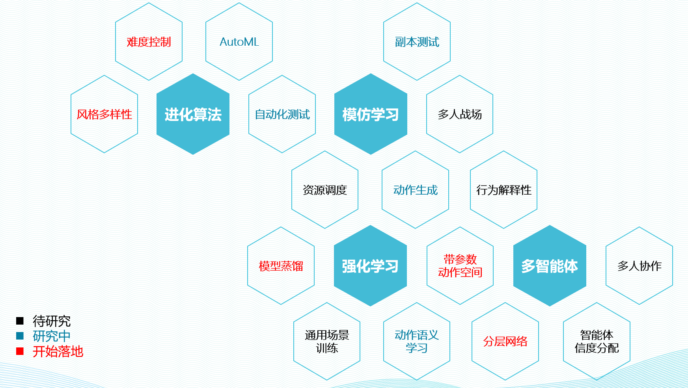

# 强化学习开放课题介绍

网易伏羲强化学习组以“游戏AI点亮游戏未来”为宗旨，坚持从实际项目需求出发， 解决真实场景落地应用的项目难题， 同时挖掘强化学习在“Game AI”外的应用潜力。目前我们在角色扮演游戏（RPG），体育游戏， 动作战斗游戏（ACT）， 棋牌， 卡牌， 射击游戏（FPS），智能游戏测试领域以及 游戏资源调度领域积累了大量的有价值研究问题， 同时我们也积极开放已有的游戏场景，欢迎各位研究同行一起探索强化学习在游戏领域的研究课题。

# 强化学习组研究课题概览

伏羲强化学习组目前包括(深度)强化学习，模仿学习，多智能体和进化算法四大研究方向，结合实际场景落地需求我们形成了数十个小研究方向， 覆盖强化学习领域众多领域。

# 合作成果

目前我们已经和清华大学， 新加坡南洋理工大学， 南京大学， 天津大学， 中国科学技术大学， 浙江大学， 微软亚研院等高校或研究机构建立了形式灵活多样的合作关系， 产出NIPS, AAAI, IJCAI, ICLR等顶会论文数十篇， 并多次举办学术或行业Workshop会议，很多研究成果已经在多款游戏和场景得到应用。期待能和更多的研究者共同探索游戏未来。

期待您的加入！ 

请联系：
chenyingfeng1@corp.netease.com