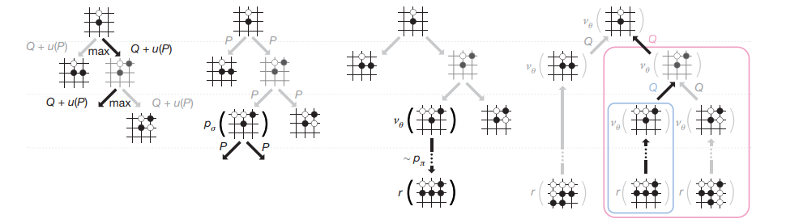

# 课题背景

回合制是一种游戏打怪形式，所有游戏内玩家轮流自己的回合，只有轮到自己的回合，才能够进行操纵。现在越来越多的游戏都会出一些回合制的休闲玩法，主打回合制的卡牌游戏也是层出不穷，其中根据游戏类型可以分为完全信息博弈和不完全信息博弈：完全信息博弈是指所有玩家的信息都公开可见，如围棋、象棋、五子棋等；不完全信息博弈是指游戏中有只对玩家自己可见的私有信息，如麻将、德扑、昆特牌、文明等。为这类游戏编写一个强力AI是一件很困难的事，需要编写者对游戏有着很强的理解，而且通常具有各种漏洞，因此使用强化学习算法以更加通用的方式学习出一个AI是大势所趋。

# DEMO

随着近几年强化学习的发展，完全信息博弈的回合制游戏可以通过蒙特卡洛树搜索（MCTS）+ 深度学习解决，如AlphaZero、MuZero算法；不完全信息博弈的游戏还没有通用解法，有一些研究通过虚拟遗憾最小化（CounterFactual Regret Minimization）解决了多人德州扑克，但需要很多对游戏的先验知识，不方便迁移。本文简要介绍一下以MCTS为基础的回合制游戏的强化学习算法。

蒙特卡罗树搜索是一类树搜索算法的统称，可以较为有效地解决一些探索空间巨大的问题。树中的每个节点对应游戏中的一个真实state，每条边对应该state下的每个action。MCTS包含多次rollout，每次rollout分为四步：

1. 选择
从根节点开始向下遍历，在每个节点处根据UCT或PUCT算法选择一个action进行执行，直到新节点不在树中为止

2. 扩展
把新节点加入搜索树

3. 评估
使用评估算法评估新节点的价值，评估算法可以是神经网络，也可以是随机模拟，也可以是规则等

4. 回溯
从新节点沿着逆向访问路径更新途中每条边的价值

当做完一定次数的rollout之后，就可以根据根节点下每个action的访问次数选择最终要做action。

# 问题挑战

* 通常没有中间reward
* 搜索算法通常需要环境支持reset到任意state
* 方便迁移的不完全信息博弈的解决办法

# 环境支持

RLEase中内置的MCTS算法及各种棋牌类游戏

# 评价指标

ELO或TrueSkill评分

# 相关学术论文

1. [2019-MuZero Mastering Atari, Go, Chess and Shogi by Planning with a Learned Model](https://arxiv.org/abs/1911.08265)
2. [2017-AlphaZero Mastering Chess and Shogi by Self-Play with a General Reinforcement Learning Algorithm](https://arxiv.org/abs/1712.01815)
3. [2019-Pluribus Superhuman AI for multiplayer poker](https://science.sciencemag.org/content/365/6456/885)
4. [2018-Libratus Depth-Limited Solving for Imperfect-Information Games](https://arxiv.org/abs/1805.08195)

# 联系我们

有任何问题，请联系liuhe1@corp.netease.com