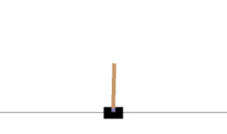
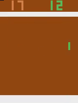

## 课题背景

近年来，深度强化学习算法在[各种游戏](https://gym.openai.com/envs/#classic_control)中均取得了不错的表现，在一些游戏中(例如[围棋](https://deepmind.com/blog/article/alphago-zero-starting-scratch)、[starcraft-ii](https://deepmind.com/blog/article/alphastar-mastering-real-time-strategy-game-starcraft-ii)、[dota2](https://openai.com/blog/openai-five-defeats-dota-2-world-champions/))能够训练得到与人类顶尖玩家持平甚至超越人类顶尖玩家的AI模型。然而，由于深度神经网络是一个黑盒模型，人类无法理解这些顶尖AI每一步操作的背后原因，导致玩家无法通过学习这些AI的游戏策略来提升自己的游戏理解。此外，深度模型的黑盒属性也让制作游戏AI的研究员无法判断深度模型的设计过程是否合理，这在一定程度上会影响AI的制作流程。因此从人类角度理解AI模型是一个非常有意义的课题。

       

## 问题定义
深度强化学习AI的决策过程是：
1.设计游戏特征作为神经网络的输入
2.特征通过神经网络前向计算得到不同动作收益的期望值
3.根据收益的大小来选择对应的动作。

模型可解释性是指从人的角度理解AI的决策过程，分析哪些特征对当前结果的选择起显著性作用，即分析哪些输入对输出有显著影响，并将这些分析结果转成人为可以理解的规则。

## 问题挑战
- 相较监督学习模型，强化学习模型有着更多的信息（例如动作收益的期望值），如何在解释模型策略的过程中利用这些额外信息是一个比较大的挑战。
- 网络的输入信息很多，而人只希望得到一些精简的结论，如何筛选出重要信息并转为人可以理解的文字描述是一项很大的挑战。

## 实验环境
请以下环境中任选一款游戏作为实验环境
- openai gym [classic control](https://gym.openai.com/envs/#atari)
- [atari](https://gym.openai.com/envs/#atari)

注：请先利用任一强化学习算法(代码实现可以参考https://github.com/openai/baselines) 训练得到能够通关游戏环境的AI模型(输入可以是图像，也可以是文本形式的特征)，再设计方案对该模型的策略进行解释，分析哪些输入状态对输出结果有显著性影响。

## 评价指标
- 对模型策略解释的合理性。
- 利用解释结果编写对应规则，并验证该规则在游戏环境中能得到的奖赏值是否与原模型相当。

## 相关文献
- [Explainable Artificial Intelligence (XAI): Concepts, Taxonomies, Opportunities and Challenges toward Responsible AI](https://arxiv.org/pdf/1910.10045.pdf)
- [Toward Interpretable Deep Reinforcement Learning with Linear Model U-Trees](https://arxiv.org/pdf/1807.05887)
- [Verifiable Reinforcement Learning via Policy Extraction](https://papers.nips.cc/paper/7516-verifiable-reinforcement-learning-via-policy-extraction.pdf)
- [Tree Based Discretization for Continuous State Space Reinforcement Learning](http://www.cs.cmu.edu/~mmv/papers/will-aaai98.pdf)

## 联系方式：

- 有任何问题，欢迎联系chenke3@corp.netease.com