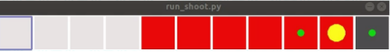

# 课题背景

一般情况下，神经网络对于相似的输入会产生相近的输出，这在相似输入对应不同真值时就会产生误判问题。为了增大关键输入间的区别，通常会在状态表示、网络结构上进行一定的优化。例如，使用one-hot状态表示替换数值的index，采取卷积、attention等结构。然而在强化学习问题中，这些方法都各自有一定的局限性，不能完全解决该问题。此外，基于temporal difference (TD) 的更新方式还会使得误差不断被传递。

在实际游戏应用中，这种问题也很常见。例如对技能CD进行刻画时，如果使用浮点数表示CD值，则神经网络很难区分0和0.1应当输出不同动作。

如何用一种更通用的方式学习出较好的特征表示，是本课题主要面对的问题。

# 问题定义

.assets/image-20200113143733189.png)如图1所示，给定2维grid world，黄色表示agent，绿点表示agent攻击范围；灰色表示敌人位置，红色表示敌人攻击范围；Agent（敌人）具有一定初始血量和攻击力，且在对方的射程内时会受到攻击；Agent可以移动，且在敌人攻击射程外时会回复自身损失的血量。敌人不会移动，不能回血。一方血量减少到0则游戏结束；Agent攻击力和攻击距离固定，但环境中有不同攻击力和攻击距离的敌人，所以agent需要识别出是何种敌人才能采取相应的最优策略。

### 环境信息

**State：**[agent坐标x, agent血量HP1, 敌人血量HP2]；

**Action：**左、右；

**隐状态：**敌人攻击力、敌人攻击范围

**给定agent属性：**

{'x': 0, 'y': 0, 'hp': 10, 'max_hp': 10, 'damage': 4, 'attack_range': 1, 'heal_buff': 10}

**给定3种不同属性敌人用于训练：**

[{'x': x, 'y': y, 'hp': 10, 'max_hp': 10, 'damage': 4, 'attack_range': 1, 'heal_buff': None},

 {'x': x, 'y': y, 'hp': 10, 'max_hp': 10, 'damage': 3, 'attack_range': 2, 'heal_buff': None},

 {'x': x, 'y': y, 'hp': 10, 'max_hp': 10, 'damage': 1.2, 'attack_range': 6, 'heal_buff': None},

 ]

**给定额外未知敌人，用于测试泛化性：**

[{'x': x, 'y': y, 'hp': 10, 'max_hp': 10, 'damage': 2.9, 'attack_range': 2, 'heal_buff': None},

 {'x': x, 'y': y, 'hp': 10, 'max_hp': 10, 'damage': 2.8, 'attack_range': 2, 'heal_buff': None},

 {'x': x, 'y': y, 'hp': 10, 'max_hp': 10, 'damage': 2.7, 'attack_range': 2, 'heal_buff': None},

 {'x': x, 'y': y, 'hp': 10, 'max_hp': 10, 'damage': 2.6, 'attack_range': 2, 'heal_buff': None},

 {'x': x, 'y': y, 'hp': 10, 'max_hp': 10, 'damage': 2.5, 'attack_range': 2, 'heal_buff': None},

 {'x': x, 'y': y, 'hp': 10, 'max_hp': 10, 'damage': 1.5, 'attack_range': 3, 'heal_buff': None},

 ]

### 目标

1. 无论面对何种敌人，agent都可以获胜。即取得环境最大可能reward；
2. 验证训练出的模型对于未知敌人的泛化性；
3. 如何提升模型在测试中对于未知敌人的泛化性（进阶）；
4. 考虑到环境中敌人的风格不会改变，可否使用这一信息得到固定的风格向量？（进阶）

# 问题挑战

该问题主要存在以下几个挑战：

- 如何设计模型来对对手进行建模。包括方法选择，输入输出定义，训练方式等。
- 如何将对手建模与强化学习过程相结合。

# 环境支持

可提供包含多种对手的对战模拟环境。

# 评价指标

- Reward

# 相关学术论文

1. 2016- Opponent Modeling in Deep Reinforcement Learning.

2. 2018- Modeling Others using Oneself in Multi-Agent Reinforcement Learning.

3. 2017- Robust imitation of diverse behaviors.

4. 2017- InfoGAIL: Interpretable Imitation Learning from Visual Demonstrations.

# 联系我们

有任何问题，请联系songyan@corp.netease.com